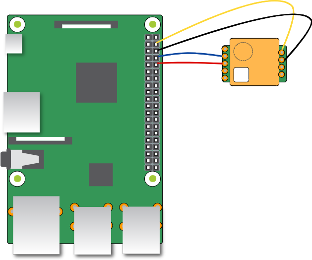

# raspberry-mh_z19

For more information,please visit https://qiita.com/revsystem/items/76ab1e21d386c5977892 (in Japanese.)

## Raspberry Pi and mh_z19 connection diagram



## Raspberry Pi config

```shell-session
sudo raspi-config
```

`5 Interfacing Option` -> `P6 Serial`
> Would you like a login shell to be accessible over serial?

-> No

> Would you like the serial port hardware to be enabled?

-> Yes

## install mh-z19 library

```shell
sudo pip3 install mh-z19
sudo apt-get install jq ruby
```

### mh_z19 command

You can get CO2 value with below command.

```shell-session
sudo python3 -m mh_z19
{"co2": 398}
```

```shell-session
sudo python3 -m mh_z19  --all
{"co2": 383, "temperature": 26, "TT": 66, "SS": 0, "UhUl": 0}
```


## Example of mackerel-agent.conf

```:/etc/mackerel-agent/mackerel-agent.conf
[plugin.metrics.co2]
command = "ruby /home/pi/mackerel/mh_z19_monitoring.rb"
env = { MONITOR = "co2" }

[plugin.metrics.temp]
command = "ruby /home/pi/mackerel/mh_z19_monitoring.rb"
env = { MONITOR = "temperature" }
```


## reference

command reference:
<https://pypi.org/project/mh-z19/>

Calibration reference:
<https://github.com/UedaTakeyuki/mh-z19/wiki/CALIBRATION-&-detection-range>